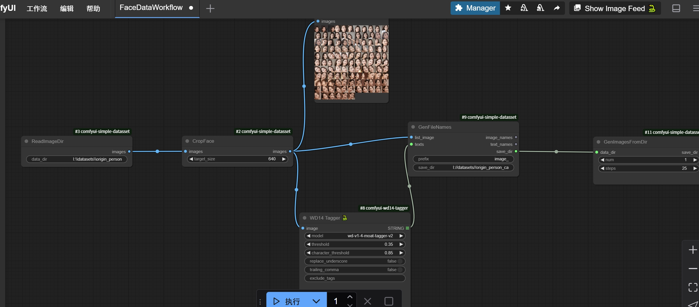

# comfyui-SimpleDataUtils

## Simple1
* workflows/FaceDataWorkflow.json
  * input:{images_dir}
  * description: crop face and caption it from every image in images_dir and save to new dir {images_dir}_cap
